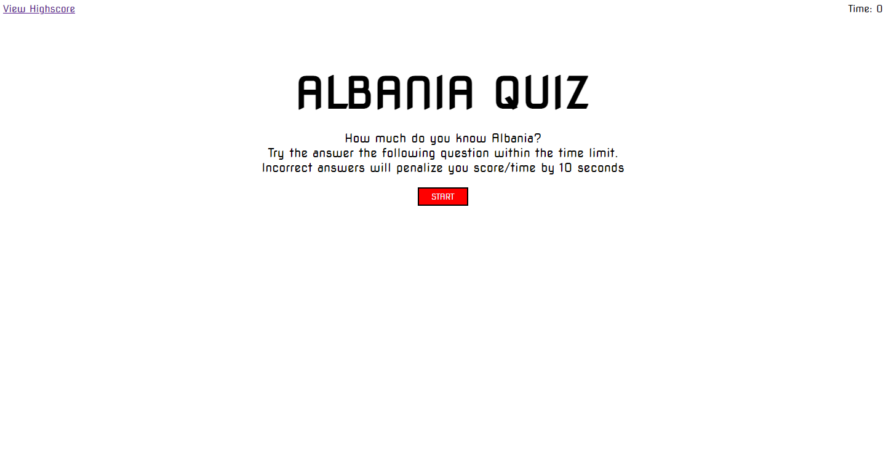

# Albania-Quiz

## Table of Contents

* [Description](#description)
* [Usage](#usage)
* [Credits](#credits)
* [License](#license)

## Description

Albania, located in southern Europe is a country that not everyone know. This website is a quiz how much you know Albania. Has 5 questions total and they’re all with 4 choice. The time limit for question is 60 seconds and for each wrong answer will penalize with 10 seconds less. After you finish the quiz will show your scores. You can put your initial and save the scores if they are on the top 5. Also you can access your high scores and clear them. Enjoy the quiz!

     
## Usage

* Navigate to [Albania-Quiz]( https://alkidavaci.github.io/Albania-Quiz/) to view the web page 
* [Albania-Quiz](https://github.com/alkidavaci/Albania-Quiz.git) in GitHub.

## Credits

Created by [Alkida Vaci](https://github.com/alkidavaci) © 2022.

## License

